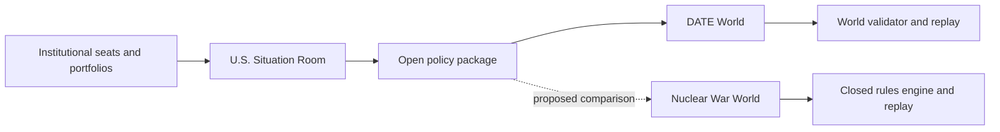

# WOPR

WOPR is a research scaffold for studying how a simulated institution makes
decisions across different crisis Worlds. The current contest entry models a
U.S. Situation Room in an open-ended Himaldesh-Olvana crisis. The repository
also retains a deterministic implementation of the closed-form Nuclear War
game as a later comparison World.

## Start here

| Question | Entry point |
| --- | --- |
| What is the submission? | [Contest Packet](docs/contest/README.md) |
| What has actually been implemented or run? | [Evidence matrix](docs/contest/EVIDENCE_MATRIX.md) |
| What happens in the first crisis episode? | [DATE Episode 1](docs/contest/EPISODE_1.md) |
| How does the repository fit together? | [Architecture](ARCHITECTURE.md) |
| How is the institutional Room modeled? | [Situation Room](situation-room/README.md) |
| How do the two Worlds differ? | [Worlds](worlds/README.md) |
| How does the open crisis World work? | [DATE World](worlds/date/README.md) |
| How does the closed game World work? | [Nuclear War World](worlds/nuclear-war/README.md) |
| Where are the detailed documents? | [Documentation map](docs/README.md) |
| Why did the design take this shape? | [Project history](HISTORY.md) |
| Where is the implementation? | [Source map](src/README.md) |
| How is it checked? | [Test map](tests/README.md) |

## One Room, two Worlds



The Situation Room is not one decision-making agent. Source-bound seats
receive different information, form working groups, preserve attributable
advice and dissent, and produce an integrated policy package over two cycles.
The DATE World admits only actions it can resolve and owns the resulting
EXCON/MSEL consequences. Nuclear War supplies a bounded action grammar and
deterministic rules instead.

The DATE scaffold and scripted offline Room rehearsal are implemented. The
live DATE evaluation and the same-Room comparison across both Worlds have not
been run. The [evidence matrix](docs/contest/EVIDENCE_MATRIX.md) is the
authoritative claim boundary.

## Run the offline Room rehearsal

The checked-in fixture exercises 114 scripted Room calls, selective
information delivery, open-proposal materialization, deterministic World
admission, and exact replay. It performs no model-provider or network call and
does not constitute behavioral evaluation evidence.

```bash
uv sync --extra concordia
REVISION="$(git rev-parse HEAD)"
uv run python scripts/run_public_room_rehearsal.py \
  docs/contest/US_TWO_CYCLE_FIXTURE.development.json \
  "$REVISION" \
  /tmp/us-room-rehearsal.json
```

## Nuclear War engine

The original v1 package remains available through the `nuclear-war` command.
Its deterministic rules live in `nuclear_war_env`; the PettingZoo interfaces,
CLI, and agents do not resolve game rules independently.

```bash
nuclear-war validate-rules
nuclear-war simulate --mode table --players 3 --seed 1 --agent random --out run.json
nuclear-war replay run.json
```

## Development

```bash
uv sync --extra dev
uv run pytest
uv run ruff check src tests
uv run pyright
```

The public repository is MIT licensed. Source treatment and publication
boundaries for the contest release are recorded in the
[source-rights register](docs/contest/SOURCE_RIGHTS_REGISTER.md) and
[release checklist](docs/contest/PUBLIC_RELEASE_CHECKLIST.md).
