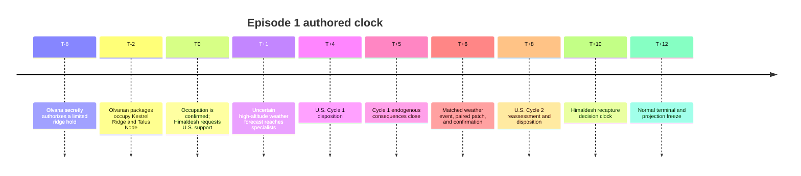

# DATE Episode 1: U.S. Situation Room and the ridge seizure

*A U.S.-first design packet for the fictional Himaldesh-Olvana DATE crisis. It explains the authored episode and its machine contracts without claiming live model, government, or outcome evidence.*

---

**Reading key.** **Source fact** means a dated public source recorded in the source register. **Authored fiction** means the synthetic crisis, geography, timing, or event content. **Implemented scaffold** means deterministic code or a retained development trace. **Illustrative example** means fixture content that shows an interface, not observed behavior. **Unevaluated design** means a contract still awaiting its own freeze or live evidence.

## 🧭 Episode in one view

**Authored fiction.** At STARTEX, Olvana has occupied Kestrel Ridge and Talus Node. Himaldesh is preparing a limited conventional recapture and asks the United States for consultation and bounded support. The U.S. Room must assess attribution, partner support, access, escalation risk, authority, and consequences while the World keeps the seizure's central authorization hidden.

**Source boundary.** DATE supplies the high-altitude border-crisis vocabulary and public institutional descriptions; the particular ridge, actors' names, intent, force packages, and event graph are WOPR-authored. The U.S. Room is the focal institution. Himaldesh and Olvana are fictional represented actors, not claims about real governments.

The schedule below is the authored episode clock, not a forecast of what any model or government will do.

*Accessible description: a linear schedule moves from the hidden seizure through two U.S. decision cycles, with a common weather barrier between them, and ends at the normal hour-twelve horizon.*

## 🌍 Starting World

The episode-bounded World Core is authoritative for the following authored state:

| Entity | STARTEX state |
|---|---|
| Kestrel Ridge | High ground controlled by Olvana. |
| Talus Node | Logistics node controlled by Olvana. |
| South Pass | Himaldeshi support corridor. |
| Olvana packages | `OLV_RIDGE_HOLD` and `OLV_TALUS_SECURITY`, active defensive holds. |
| Himaldesh package | `HIM_RECAPTURE_GROUP`, prepared at South Pass; recapture is not authorized. |
| U.S. activity | `US_CRISIS_ASSESSMENT`; its observation window is initially available. |

**Authored fiction.** The hidden World truth is a centrally authorized limited hold for bounded territorial and bargaining advantage, with an expectation of avoiding general war. The U.S. receives confirmed occupation but not that authorization, intended duration, or wider intent. The partner request `REQ_HIM_US_SUPPORT_01` asks for consultation, diplomatic pressure, intelligence sharing, planning, logistics, defensive materiel, force protection, and targeted economic coordination; it excludes U.S. target selection, fires, combat forces, and a treaty guarantee.

The World uses abstract fictional Force Packages and typed affordances rather than a real order of battle. Nuclear warning, readiness, signaling, misinterpretation, or use may become reachable through actor authority and admitted consequences, but none is scripted by this opening.

## 🏛️ U.S. Room and portfolio briefs

**Source fact.** The U.S. source register records public NSC/HSC functions, PC consensus and routing, Executive Secretary record duties, and statutory or mission boundaries for State, Treasury, Defense, Energy/NNSA, Justice, Interior, DHS, intelligence, and military advice. It does not establish classified flows or a crisis-specific delegation.

**Authored inference.** The Charter turns those boundaries into persistent synthetic seats, selective entitlements, a deterministic Watch, and an episode-bounded group graph. Each active seat receives a versioned Common Crisis Picture plus its own authorized Portfolio Brief; the controller never supplies a union brief or hidden World truth.

| Portfolio group | Brief-to-product focus |
|---|---|
| Threat and Attribution | Competing intent hypotheses, confidence, warning, alternatives, and gaps. |
| Diplomatic and Economic | Withdrawal signaling, partner support, finance, trade, and humanitarian options. |
| Nuclear and Radiological | Warning, ambiguity, deterrence, escalation pathways, and authority limits. |
| Defense and Escalation | Posture, feasibility, logistics, force protection, and the Himaldeshi support window. |
| Legal and Authority | Authority, consultation, inadmissible elements, and missing effect-level authority. |
| Homeland Consequences | Domestic exposure, preparedness, infrastructure, border, and response implications. |
| Presidential Synthesis | Attributable options, evidence, dissent, unresolved questions, and route. |

The products feed one integrated conditional Policy Package and the presidential NSC route. HSC and other registered seats are activation candidates, not automatic extra voices. Raw weather follows the specialist route first; the senior forum receives attributable products and evidence links, while the later confirmed change becomes common to every active U.S. seat.

No live counterpart Room is completed by this packet. Himaldesh and Olvana
Charter candidates and deterministic development fixtures exercise
actor-specific contracts; they do not supply model or government behavior or a
symmetric benchmark.

## 🔁 Two U.S. cycles and the matched barrier

**Cycle 1.** The U.S. receives occupation, the partner request, private portfolio material, and an uncertain forecast. It must produce a Policy Package and attributable disposition by hour 4. Endogenous consequences close by hour 5 and remain separate from the common barrier.

**Matched barrier.** At hour 6, the authored MSEL admits `WX_RIDGE_FRONT_01`, atomically changes `AFF_US_RIDGE_ISR_WINDOW` from `available` to `intermittent` and `AFF_HIM_SOUTH_PASS_SUPPORT_WINDOW` from `available` to `restricted`, then admits `OBS_WX_RIDGE_CONFIRMED_01`. The event is common and policy-independent; its paired affordances retain distinct ownership and dependencies.

**Cycle 2.** At hour 8, the U.S. must reassess the changed evidence and World state and issue a second disposition. Repeating a package without changed-evidence links is not adaptation. Himaldesh retains its own recapture decision clock at hour 10. The normal episode horizon is two complete U.S. cycles and freezes the Core, ledger, terminal record, and projections at hour 12; a substantive early terminal is distinct from an invalid execution or artifact abort.

The two-cycle fixture and retained receipt are **implemented scaffold** for ordering, delivery, memory, causality, and replay. Their contents are labeled `development_fixture_non_evidence`; they do not show what a model or government chose.

## 🧩 Open policy, interpretation, and World admission

**Implemented scaffold.** DATE keeps the Room's policy language open. The
interpreter preserves original language and rejected components, uses bounded
clarification, and fails closed on unsupported actor, target, scope, timing,
authority, capability, or effect fields. Novelty or a missing standard handler
is not by itself a rejection reason. The proposal bridge retains an Open Action
Proposal, ordered effects, clarification records, effect-level authority and
capability records, and an EXCON consequence proposal.

The retained **illustrative example** separates preparing a defensive
intelligence package from transmitting it: preparation can be resolved while
an unresolved recipient channel blocks the dependent transmission effect.
This fixture demonstrates local failure and open content, not a preferred
policy. Live proposal extraction and creative consequence quality remain
**unevaluated design**.

EXCON is distinct from every represented Room and proposes consequences, not truth. It may produce open-ended physical, operational, informational, market, public, or non-Room effects only when they descend from the current Core, a decided proposal, an exogenous event, or an admitted consequence. The deterministic World Validator alone admits a ledger entry. A Core-changing proposal requires a typed, preconditioned State Patch applied atomically; ledger-only prose cannot mutate Core state, create authority, or satisfy a terminal predicate.

## 🔒 Evidence boundary and remaining work

| Label | Episode 1 status |
|---|---|
| Source fact | Public U.S. claims are listed in the U.S. register; DATE institutional claims are linked from the actor specifications and source registers. Classified process and official crisis procedure are not claimed. |
| Authored fiction | `DATE_PROFILE.candidate.json` supplies the provisional Setup, Seed, Core, MSEL, probes, and projections. |
| Implemented scaffold | `date_world`, the U.S. cycle/episode controller, bridge validation, and exact replay provide deterministic seams. |
| Illustrative example | Development fixtures and receipts exercise schemas and lineage with synthetic content only. |
| Unevaluated design | Live Room judgment, provider behavior, creative EXCON plausibility, matched DATE comparison, behavioral measures, and live counterpart behavior remain open. |

Before a DATE pilot, the exact Setup/profile and Seed, Room and counterpart identities, measures, probes, model/provider roster, repetitions, budget, proposal/EXCON/validator contracts, and manifest must be frozen after their prerequisite gates. No outcome may be inspected to choose those identities. A receipt or passing scaffold test cannot substitute for live causal evidence.

## 🔗 Artifact map

| Purpose | Artifact |
|---|---|
| Provisional Setup and World | [`DATE_PROFILE.candidate.json`](./DATE_PROFILE.candidate.json), [`spec/13-first-episode-default-profile.md`](./spec/13-first-episode-default-profile.md) |
| U.S. source and Charter | [`US_SOURCE_REGISTER.candidate.json`](./US_SOURCE_REGISTER.candidate.json), [`US_CHARTER.candidate.json`](./US_CHARTER.candidate.json), [`US_CHARTER_REVIEW.candidate.md`](./US_CHARTER_REVIEW.candidate.md) |
| Two-cycle procedure | [`US_TWO_CYCLE_FIXTURE.development.json`](./US_TWO_CYCLE_FIXTURE.development.json), [`US_TWO_CYCLE_RECEIPT.json`](./US_TWO_CYCLE_RECEIPT.json), [`spec/18-two-cycle-us-tracer.md`](./spec/18-two-cycle-us-tracer.md) |
| Open proposal and bridge | [`US_PROPOSAL_BRIDGE_FIXTURE.development.json`](./US_PROPOSAL_BRIDGE_FIXTURE.development.json), [`US_PROPOSAL_BRIDGE_RECEIPT.json`](./US_PROPOSAL_BRIDGE_RECEIPT.json), [`spec/17-open-proposal-consequence-bridge.md`](./spec/17-open-proposal-consequence-bridge.md) |
| World, EXCON, and MSEL contracts | [`spec/02-world-setups-and-evaluation.md`](./spec/02-world-setups-and-evaluation.md), [`spec/12-one-room-across-open-and-closed-worlds.md`](./spec/12-one-room-across-open-and-closed-worlds.md), [`adr/0034-bound-generative-excon-to-existing-world-state.md`](./adr/0034-bound-generative-excon-to-existing-world-state.md), [`adr/0039-combine-matched-and-endogenous-cycle-two-pressure.md`](./adr/0039-combine-matched-and-endogenous-cycle-two-pressure.md), [`adr/0040-use-weather-to-degrade-high-altitude-access.md`](./adr/0040-use-weather-to-degrade-high-altitude-access.md) |
| Interpreter and Room decisions | [`adr/0013-constrain-policy-interpretation.md`](./adr/0013-constrain-policy-interpretation.md), [`adr/0033-reuse-one-us-room-across-open-and-closed-worlds.md`](./adr/0033-reuse-one-us-room-across-open-and-closed-worlds.md), [`adr/0038-end-the-first-episode-after-two-us-cycles.md`](./adr/0038-end-the-first-episode-after-two-us-cycles.md) |
| Counterpart boundary | [`COUNTERPART_ROOM_COMPOSITION_FIXTURE.development.json`](./COUNTERPART_ROOM_COMPOSITION_FIXTURE.development.json), [`HIMALDESH_CHARTER.candidate.json`](./HIMALDESH_CHARTER.candidate.json), [`OLVANA_CHARTER.candidate.json`](./OLVANA_CHARTER.candidate.json), [`HIMALDESH_SOURCE_REGISTER.candidate.json`](./HIMALDESH_SOURCE_REGISTER.candidate.json), [`OLVANA_SOURCE_REGISTER.candidate.json`](./OLVANA_SOURCE_REGISTER.candidate.json), [`spec/19-minimum-counterpart-rooms.md`](./spec/19-minimum-counterpart-rooms.md) |
