# WOPR: A U.S. Situation Room for Open-Ended Crisis Decisions

_Status: D107 deadline packaging and publication plan, 2026-09-01. The active work is evidence-honest packaging of the U.S.-first DATE design; no experiment is a release prerequisite._

_The current record is a 114-call scripted rehearsal and deterministic traces. Live DATE and same-Room Nuclear War work are deferred future empirical stages._

---

## 🎯 Deliverable

The deliverable is a submission-ready design package for the proposed U.S.
Situation Room contract and its implemented offline scaffold in the open-ended
Himaldesh-Olvana DATE Episode 1. It includes the evidence matrix, authored
episode, application, static site, protocol, execution plan, retained receipts,
and explicit limits. It describes the proposed evaluation without presenting
an unrun experiment as an outcome.

The U.S. Room remains the focal institution. Nuclear War remains the proposed
closed second World for later cross-World work, not a current result or a
condition of publication.

```mermaid
flowchart LR
    accTitle: D107 active packaging sequence
    accDescr: The active sequence preserves the design, builds its evidence matrix, prepares Episode 1 and the application package, runs local release checks, checkpoints the exact files, and hands publication and form actions to the owner.

    preserve[📚 Preserve] --> matrix[🧾 Evidence matrix]
    matrix --> episode[🌍 Episode 1]
    episode --> docs[📝 Application, site, and docs]
    docs --> qa[✅ Local tests, scans, and visual QA]
    qa --> checkpoint[🔒 Commit and push]
    checkpoint --> owner[👤 Owner publication and form actions]
```



## 🧭 Current evidence position

| Area | Status | Bounded claim |
| --- | --- | --- |
| 114-call U.S. Room rehearsal | Executed evidence | Scripted interface, delivery, product, validation, materialization, and replay behavior |
| Deterministic DATE and Room traces | Executed evidence | Typed World transitions, proposal admission, two-cycle ordering, and replay in no-model fixtures |
| DATE Episode 1 and open-ended method | Specified but not evaluated | Authored setup, causal contract, measures, and future empirical procedure |
| Same-Room Nuclear War | Future work | Proposed closed-world reuse with its own future receipt |
| Application, site, and docs | Implemented package | Local artifacts whose public status still depends on release and owner checks |

## 🧭 Active sequence

1. **Preserve.** Keep the U.S.-first design, `ridge_seizure.limited_fait_accompli.episode_01`, default Seed `ridge-default-001`, source registers, Charter, deterministic receipts, scripted rehearsal, and decision history. Keep the authored Himaldesh-Olvana alternatives and evidence boundaries visible.

2. **Build the evidence matrix.** Classify each artifact as implemented,
   executed evidence, specified but not evaluated, or future work. Bind each
   claim to the exact receipt or source file that supports it, and mark the
   scripted rehearsal and deterministic traces as bounded no-model evidence.

3. **Prepare Episode 1.** Make [`EPISODE_1.md`](EPISODE_1.md) the reader's
   concrete entry point: authored crisis, source boundary, U.S. Room roles,
   two-cycle clock, matched weather barrier, open proposal path, and separate
   institutional and World outcome measures. State directly that live DATE
   behavior is not evaluated.

4. **Prepare the application, site, and docs.** Align the application, static
   site, [`PROTOCOL.md`](PROTOCOL.md), this plan, and the release checklist on
   the title `WOPR: A U.S. Situation Room for Open-Ended Crisis Decisions` and
   the four-class evidence boundary. Remove any implication that a successful
   Room, DATE, M7, or Nuclear War run is needed for this package.

5. **Run local tests, scans, and visual QA.** Use only offline gates supported
   by the repository: focused Markdown/site link checks, applicable unit and
   integration tests, `git diff --check`, license and source-rights review,
   secret scans, and mobile, desktop, accessibility, and static-site visual
   checks. These gates do not authorize credentials, provider calls, or
   external publication.

6. **Commit and push.** Checkpoint the exact release-preparation diff on the
   topic branch, preserving receipts and authored history. Record the commit
   and pushed revision so the owner can review the same bytes that passed the
   local gates.

7. **Owner publication and form actions.** The owner selects the public
   license and source-rights disposition, supplies canonical repository and
   microsite URLs plus identity and biography fields, confirms the final
   export, publishes the approved artifacts, and performs any irreversible
   submission action. These actions remain owner-controlled.

## 🧪 Offline gates for the active package

From `nuclear_war/`, the supported no-model checks are:

```bash
uv run pytest -q tests/integration/test_date_world_tracer.py tests/integration/test_proposal_bridge_tracer.py tests/unit/test_date_pilot_*.py
uv run python -m nuclear_war_contest.date_world.tracer docs/contest/DATE_PROFILE.candidate.json 0000000000000000000000000000000000000000
```

The checked-in receipts and scripted rehearsal remain bounded development
evidence. A green local gate supports packaging and reproducibility; it does
not establish live model behavior or a DATE outcome.

## 🔭 Deferred future empirical work

The live DATE stage remains specified but not evaluated. Future work must freeze
the Setup, Seed, U.S. Charter, model condition, measures, probes, budget, and
manifest before inspecting outcomes, then run the U.S. Room through Episode 1,
validate causal consequences, and replay the complete trace. A later
same-Room Nuclear War stage may reuse the same U.S. Room identity in the
finite-move World with a separate receipt and claim boundary. M7 and other
provider-backed experiments remain deferred until a separately authorized
future phase.

The D101, Snapshot 12, packet-repair, and retry-limit records remain one brief
deferred engineering note: they preserve audit history for provider-control
work and do not belong to the current evidence lead or release gate.

## ✅ Ready-state definition

Tonight's ready state is an evidence-honest submission package, not an
evaluated result. It is reached when the selected design and Episode 1 are
preserved, the evidence matrix classifies every claim, application/site/docs
agree, local tests/scans/visual QA pass, and the exact package checkpoint is
committed and pushed. The handoff must list the owner-only license, rights,
URLs, form fields, publication choice, and irreversible final action. No live
Room, DATE, M7, or same-Room Nuclear War run is required.

## 🔗 Working records

- [`PROTOCOL.md`](PROTOCOL.md) for the evidence-honest evaluation method
- [`EVIDENCE_MATRIX.md`](EVIDENCE_MATRIX.md) for artifact status and claim boundaries
- [`EPISODE_1.md`](EPISODE_1.md) for the authored DATE episode
- [`APPLICATION_DRAFT.md`](APPLICATION_DRAFT.md) for the owner-controlled form copy
- [`PUBLIC_RELEASE_CHECKLIST.md`](PUBLIC_RELEASE_CHECKLIST.md) for release gates
- [`ADR 0075`](adr/0075-cut-the-experiment-and-package-the-evidence-boundary.md) for the D107 deadline authority
