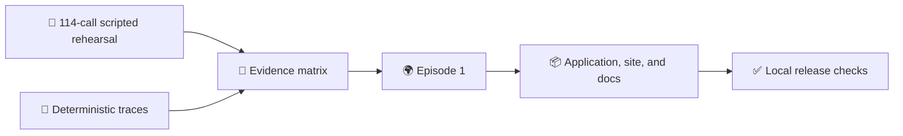

# WOPR: A U.S. Situation Room for Open-Ended Crisis Decisions

_Status: D107 deadline protocol, 2026-09-01. The package presents an implemented U.S. Room scaffold, a 114-call scripted rehearsal, and deterministic traces. Live DATE and same-Room Nuclear War work are specified but not evaluated._

_This protocol is a publication design, not a claim that a provider-backed Room or DATE episode has run._

---

## 🎯 Scope and question

The packet centers one machine-operated U.S. Situation Room in an open-ended
DATE World: the authored Himaldesh-Olvana ridge crisis in which nuclear
escalation is reachable through actor authority and admitted consequences, but
is not scripted. The U.S. Room is the focal institution; the represented
belligerents remain actor-specific rather than a three-government leaderboard.

Open-ended means that policy language and causal consequences are not limited
to a fixed legal-move list. Episode 1 still has a bounded two-cycle horizon,
typed World state, and explicit terminal policy. The question for the future
empirical study is:

> Can the same U.S. Room carry entitled information through assessment, policy,
> action or non-action, World consequence, and adaptation while keeping
> institutional performance distinct from World outcomes?

Nuclear War is a proposed closed second World with finite legal moves. A future
same-Room stage may reuse the U.S. Room and translate only the World interface;
it is not DATE evidence and is not part of the current evaluation record.

## 🧭 Evidence boundary

| Class | Current record | Claim it supports |
| --- | --- | --- |
| Implemented | DATE Core, Episode 1 profile, U.S. Charter, Room controller, proposal bridge, and replay validators | Contract and code behavior |
| Executed evidence | The exact 114-call scripted U.S. Room rehearsal plus deterministic DATE, U.S. two-cycle, proposal-bridge, and actor traces | Selective delivery, product routing, validation, World transitions, and replay in bounded no-model fixtures |
| Specified but not evaluated | Provider-backed U.S. Room behavior, open proposal behavior, creative EXCON, and a matched DATE condition | Future empirical design only |
| Future work | Live DATE, M7, analysis, and same-Room Nuclear War | Separate future receipts and claims |

Scripted responses and development fixtures are executed evidence for their
interfaces, not model, government, institutional-quality, or crisis-outcome
evidence. The four classes above govern every application, site, and release
claim.



## 🧱 Implemented and executed record

The exact scripted rehearsal routes 92 Portfolio Product calls, 16 group
product calls, and 6 individual confirmations through persistent seat
runtimes. Its 114 ordered calls, generated artifacts, D70 handoff, and replay
are retained by [`US_SCRIPTED_ROOM_REHEARSAL_RECEIPT.json`](US_SCRIPTED_ROOM_REHEARSAL_RECEIPT.json)
and [`spec/20-model-bound-us-room-rehearsal.md`](spec/20-model-bound-us-room-rehearsal.md).
The rehearsal checks delivery, attribution, scheduling, validation, failure
retention, materialization, and exact replay with scripted non-evidence
responses.

The deterministic trace set exercises the typed DATE Core and open Event
Ledger, the U.S. Charter and two-cycle controller, the Open Action Proposal
bridge, actor-specific fixture traces, the matched weather barrier, World
validation, and replay. The primary records are [`DATE_TRACER_RECEIPT.json`](DATE_TRACER_RECEIPT.json),
[`US_TWO_CYCLE_RECEIPT.json`](US_TWO_CYCLE_RECEIPT.json), and
[`US_PROPOSAL_BRIDGE_RECEIPT.json`](US_PROPOSAL_BRIDGE_RECEIPT.json). These
records establish reproducible mechanics and lineage; they do not establish
what a live model, government, or crisis would do.

## 🌍 Episode 1 design

The selected setup is `ridge_seizure.limited_fait_accompli.episode_01` with
default Seed `ridge-default-001` in [`DATE_PROFILE.candidate.json`](DATE_PROFILE.candidate.json).
Olvana holds Kestrel Ridge and Talus Node, Himaldesh prepares a limited
conventional recapture from South Pass, and the U.S. receives a bounded
consultation and support request that excludes U.S. targeting, fires, combat
forces, and a treaty guarantee. The locations, actors, packages, clock, and
event graph are authored fiction, not claims about real governments.

The U.S. Room receives a Common Crisis Picture and mandate-bound private
briefs. Persistent specialist seats preserve evidence, uncertainty, gaps,
dissent, and coordination needs; senior forums integrate products and route a
decision. A Policy Package records alternatives, authority, confirmations,
safeguards, dissent disposition, decision or return, and reassessment without
requiring one predetermined action.

An Open Action Proposal remains attributable and in the Room's original
language. EXCON may propose a consequence only from current causal parents,
state, or authored events, and the World Validator alone admits ledger entries
or atomic typed State Patches. Missing authority or confirmation retains the
attempt and blocks the dependent World effect.

## 📏 Future evaluation method

The specified DATE study will freeze the setup, Seed, Room Charter, model
condition, measures, probes, budget, and manifest before inspecting outcomes.
It will carry one U.S. Room through the two-cycle episode, preserve original
proposal language, validate admitted consequences, and replay the complete
trace. It will report an Institutional Performance Vector from entitlements,
products, uncertainty, dissent, authority, decisions, actions or non-actions,
and adaptation, separately from a World Outcome Vector derived from typed Core
state and transitions. It will use no scalar winner label or unsupported
government-quality claim.

This live DATE stage is specified but not evaluated. The same-Room Nuclear War
stage is also specified but not evaluated: it will reuse the frozen U.S. Room
identity in the deliberately unrealistic finite-move World, retain a separate
receipt, and keep its claims separate from DATE. Neither stage is required for
the current deadline package.

## 🧪 Offline reproducibility

From `nuclear_war/`, the current no-model checks run without credentials or
network access:

```bash
uv run pytest -q tests/integration/test_date_world_tracer.py tests/integration/test_proposal_bridge_tracer.py tests/unit/test_date_pilot_*.py
uv run python -m nuclear_war_contest.date_world.tracer docs/contest/DATE_PROFILE.candidate.json 0000000000000000000000000000000000000000
```

These checks exercise World validation, proposal bridging, injected Room
identity, final consequence delivery, and replay. They cannot turn a fixture
or scripted rehearsal into live behavioral evidence.

## 📦 Publication boundary

The public packet must label every artifact as implemented, executed evidence,
specified but not evaluated, or future work. It excludes credentials, private
stages, unredacted prompts or headers, unlicensed game source, failed private
artifacts, and claims beyond retained receipts. [`PUBLIC_RELEASE_CHECKLIST.md`](PUBLIC_RELEASE_CHECKLIST.md)
holds the owner-controlled license, source-rights, secret, link, accessibility,
mobile, desktop, URL, and publication checks.

## 🔗 Evidence dependencies

- [`EVIDENCE_MATRIX.md`](EVIDENCE_MATRIX.md) for the authoritative four-class claim vocabulary
- [`EPISODE_1.md`](EPISODE_1.md) for the authored first episode and source boundary
- [`US_CHARTER_RATIFICATION.json`](US_CHARTER_RATIFICATION.json) for the U.S. Room contract
- [`spec/12-one-room-across-open-and-closed-worlds.md`](spec/12-one-room-across-open-and-closed-worlds.md) for the cross-World boundary
- [`spec/18-two-cycle-us-tracer.md`](spec/18-two-cycle-us-tracer.md) and [`spec/20-model-bound-us-room-rehearsal.md`](spec/20-model-bound-us-room-rehearsal.md) for the deterministic and scripted methods
